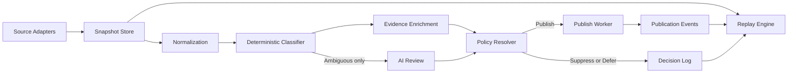

# System Overview

The CVE Intelligence Bot Mk2 is organized as a stateful pipeline with deterministic policy enforcement ahead of selective AI review.

## Components

- ingestion adapters pull CVE and advisory source data into normalized snapshots
- canonicalization services map vendor and product aliases to internal identities
- deterministic classifier assigns rules, deny reasons, and trace codes
- evidence collectors gather PoC, KEV, and related exploitability references
- AI review evaluates only ambiguous cases and returns advisory signals
- policy resolver combines rule outcomes, evidence, and advisory input
- publish worker emits initial posts or update posts with idempotency protection
- audit and replay services reconstruct decisions from immutable events

## Flow

## Design Notes

- The classifier always runs before AI review.
- PoC and ITW are stored as separate dimensions and must not be collapsed into a single exploitability flag.
- Policy decisions must capture rule version, policy version, input evidence, and final outcome.
- Update detection compares the current candidate state against the published state and ignores non-material churn.
